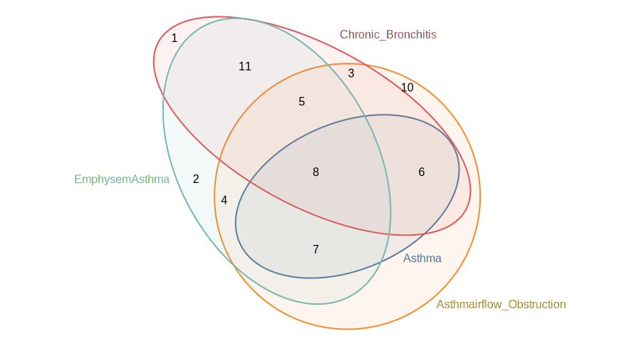

# Euler Diagrams Drawn with Ellipses Area-Proportionally (Edeap)

  <picture>
    <source media="(prefers-color-scheme: dark)" srcset="packages/edeap/example-dark.svg">
    
  </picture>

Fork of https://github.com/mjwybrow/edeap

## Monorepo

- [edeap](packages/edeap/) core package
- [demo](packages/demo/) demo website

## Similar projects

- https://github.com/upsetjs/venn.js
- https://github.com/stereobooster/venn-isomorphic

## TODO

- [ ] publish npm package
- [ ] add test for `generateDefaultLayout`
- [ ] new demo (host online)
  - add `@upsetjs/venn.js` for comparison
  - add pan/zoom to SVG
- [ ] memoization?
- [ ] expose other configurations, like weights for Optmizer etc.
